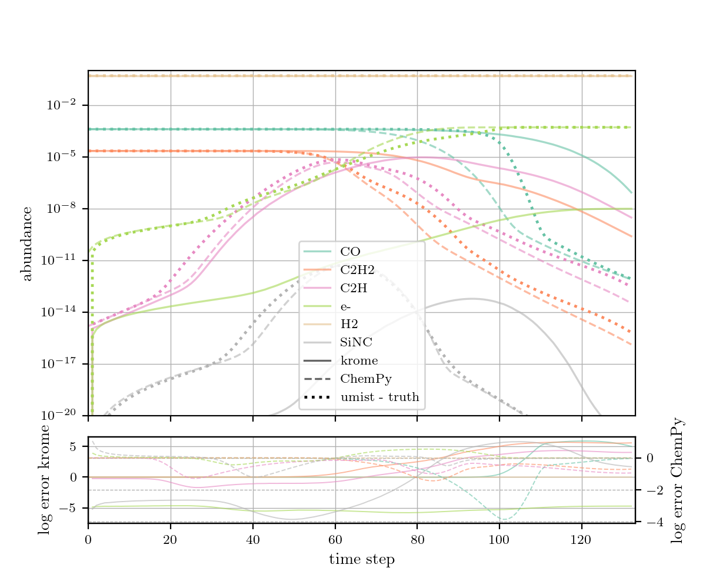

# krome-CSE
The chemistry code [KROME](https://kromepackage.org/) is *in the process of* being made compatible with our AGB circumstellar envelope (CSE) chemistry, usually calculated using the [Rate22-CSE code](https://github.com/MarieVdS/rate22_cse_code), see also this [link](http://udfa.ajmarkwick.net/index.php?mode=downloads).

**Aim**: Couple [KROME](https://bitbucket.org/tgrassi/krome/) to [PHANTOM](https://github.com/danieljprice/phantom/tree/master) to run 3D hydro-chem model of AGB outflow. 

**Why KROME?**: KROME is implemented in such a way that it can deal with running in parallel, which is needed for a coupling with PHANTOM.

---
### Notes

- KROME was once coupled to PHANTOM by W. Homan, see code [here](https://github.com/danieljprice/phantom/blob/master/src/main/krome.f90). --> Didn't work as it should, chemically speaking.

- Chemical networks were added to KROME for AGB outflows by J. Bolte, see details [here](https://github.com/IvS-KULeuven/KROME).

---

### How to run?
1. Run the bash script 
```
build_UMIST.sh chem_netw
```
with a chemical network as argument. 

2. Run the bash script 
```
make_CSEkrome.sh
```
This will make an executable for file CSE_run_krome.f.

3. Run the bash script 
```
run_CSE_krome.sh
```
 with a inputfile as argument to properly run the executable.

---

### Updates
(Latest first)

- 06/08/'24

    1. Found the first bug in the system!! Because of a type (on my side), the cosmic ray reaction rates were way to high. Fixed this.

    2. In our setup, every timestep the density is lower ($\frac{1}{^2}$-law in density). Hence, we cannot use the -useN flag (using number densities), bus have to use the -useX flag (fractions). This fixes a lot!

    --> Results now are getting decent :D

    *To do*: The photodissociation know seems to set in too late, and too few electrons. See figure, dash lines are the abundances calculated by the [Rate22-CSE code](https://github.com/MarieVdS/rate22_cse_code), full lines are the abundances calculated by KROME.
    

- 31/07/'24:

    Reading in parent species file + physical input parameters works. Initialising KROME works. Saving output of KROME works. 

    KROME chemical evolution does NOT coincide with our [Rate22-CSE code](https://github.com/MarieVdS/rate22_cse_code). We (Mats Esseldeurs and me, Silke Maes) think the issue lies within the cosmic ray reaction of H2. In the [Rate22-CSE code](https://github.com/MarieVdS/rate22_cse_code) it is assumed that H2 is fully self-shielding, so that it stays roughly constant throughout the CSE. At the moment, this assumption is not yet realised in the kromeCSE code.

    Note to self:
    Abundances (resulting from KROME) change when using -useX (mass fractions) or -useN (number density). Check later why!

- 12/07/'24:

    Correct rates, including radiation parameters $A_V$ and $\xi$ implemented (more info see [Maes et al. 2024](https://ui.adsabs.harvard.edu/abs/2024ApJ...969...79M/abstract)), via script 
    ```
    umist2krome_custm.py
    ```
    originally written by Tommaso Grassi.

- 08/07/'24:
    
    KROME runs, but the radiation component for the photodissociation reactions does not work yet. 
